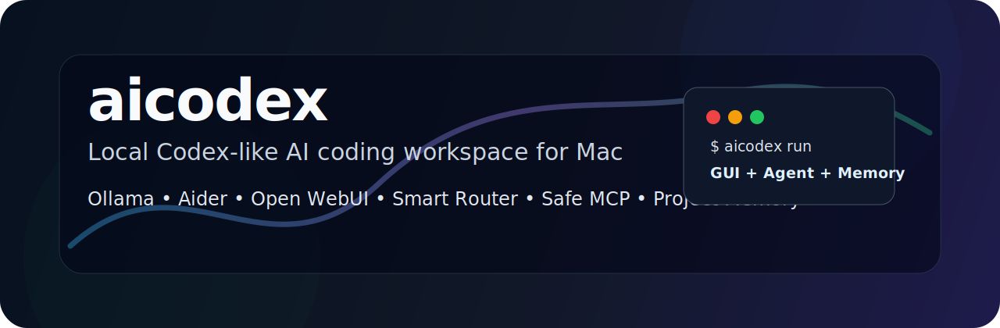
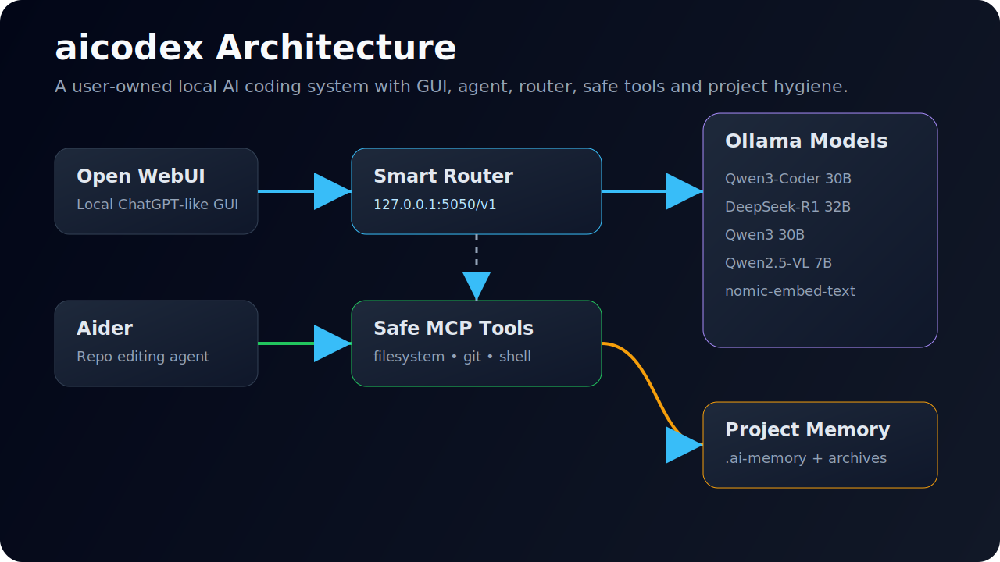

<p align="center">
  
</p>

<p align="center">
  <b>A local Codex-like AI coding workspace for Mac.</b><br/>
  Run local models, open a GUI, edit repos with Aider, route tasks automatically, use safe MCP tools, and preserve project memory.
</p>

<p align="center">
  
  
  
  
  
  
</p>

---

## What is `aicodex`?

`aicodex` is a reusable local AI coding launcher that gives you a **Codex-like workflow** on your own Mac.

It combines:

| Layer | Tool | Purpose |
|---|---|---|
| Local model runtime | **Ollama** | Runs local LLMs |
| Repo coding agent | **Aider** | Reads and edits Git repositories |
| GUI | **Open WebUI** | ChatGPT-like browser interface |
| Router | **Smart Router** | Selects the best model for each task |
| Tool layer | **Safe MCP Tools** | Controlled filesystem, Git, and shell access |
| Safety | **Git + project hygiene** | Baselines, diffs, rollback, secrets check |
| Memory | **`.ai-memory`** | Project context, decisions, commands, archives |

Main command:

```bash
aicodex run
```

---

## Why this exists

Cloud coding agents are powerful, but sometimes you want:

- local-first workflow
- more control over models
- reusable project memory
- lower dependency on cloud tools
- safe project hygiene before AI edits code
- no random global Python/npm permission issues
- a GUI-first launcher that works across projects

`aicodex` is not a 1:1 replacement for paid Codex cloud features. It is a practical local system inspired by a Codex-style workflow.

---

## Architecture

<p align="center">
  
</p>

Basic flow:

```text
User
 ↓
aicodex run
 ↓
Validate / repair tool setup
 ↓
Select project
 ↓
Project hygiene + memory restore/generation
 ↓
Open WebUI + VS Code/Finder + optional Aider
 ↓
Smart Router → Ollama models
 ↓
Safe MCP tools + Git workflow
```

---

## Features

- GUI-first launcher
- Local LLM workflow using Ollama
- Aider-based repo editing
- Smart model routing with failover
- OpenAI-compatible local router endpoint
- Safe MCP filesystem/Git/shell tools
- Project memory and archive/restore
- Git hygiene before AI changes
- Secret-file warning before AI starts
- Tool repair/reset flow
- User-owned installation directory
- Local Python virtual environments
- Local npm prefix to reduce permission issues

---

## Hardware requirements

### Recommended

| Component | Recommendation |
|---|---|
| Machine | Apple Silicon Mac |
| RAM | 64 GB or higher |
| Storage | 1 TB SSD recommended |
| Network | Good internet for model downloads |

### Minimum practical setup

| Component | Recommendation |
|---|---|
| Machine | Apple Silicon Mac |
| RAM | 32 GB |
| Storage | 500 GB |
| Models | Use smaller 7B/14B models |

> Large 30B/32B models need memory and disk space. For the best experience, use a 64 GB Mac.

---

## Models used

| Model | Role |
|---|---|
| `qwen3-coder:30b` | Main coding/editing model |
| `deepseek-r1:32b` | Architect, planner, reviewer |
| `qwen3:30b` | General reasoning and router/controller |
| `qwen2.5vl:7b` | Screenshots, diagrams, UI errors, vision tasks |
| `qwen2.5-coder:14b` | Fast fallback coding model |
| `nomic-embed-text` | Local embedding / memory support |

Role idea:

```text
DeepSeek-R1 32B      = brain / architect
Qwen3-Coder 30B      = hands / code editor
Qwen2.5-VL 7B        = eyes / screenshot understanding
nomic-embed-text     = memory / embeddings
Aider                = repo editing body
Open WebUI           = GUI
MCP                  = safe tool layer
```

---

## Installation design

The tool is designed to run from one user-owned directory:

```bash
~/.aicodex-level1
```

Directory layout:

```text
~/.aicodex-level1
├── bin              # aicodex command
├── app              # launcher scripts
├── router           # smart router Python app
├── mcp              # safe MCP tools
├── config           # default project templates
├── logs             # tool logs
├── state            # last project pointer
├── archives         # project memory archives
├── projects         # optional new projects
├── venvs            # local Python environments
├── npm-global       # local npm prefix
└── downloads        # downloaded components if needed
```

Design principles:

- no `sudo` during daily use
- no global Python package mess
- no global npm permission problem
- no tool files mixed with project files
- repair/reset affects the tool only, not user projects

---

## Install

Create and run the installer script:

```bash
chmod +x ~/aicodex-install.sh
~/aicodex-install.sh
source ~/.zshrc
```

Then start:

```bash
aicodex run
```

---

## Command reference

| Command | What it does |
|---|---|
| `aicodex run` | Full GUI-first launcher |
| `aicodex gui` | Launch GUI for the last selected project |
| `aicodex validate` | Validate the AI Codex tool itself |
| `aicodex repair` | Repair the AI Codex tool only |
| `aicodex reset` | Reset AI Codex tool config only |
| `aicodex project` | Select or prepare a project |
| `aicodex aider` | Launch Aider for selected project |
| `aicodex mcp` | Start safe MCP tools |
| `aicodex archive` | Archive project AI memory |
| `aicodex status` | Show running status |

---

## GUI-first launch behavior

`aicodex run` always tries to launch the GUI.

It opens:

- Open WebUI at `http://127.0.0.1:8080`
- the selected project in VS Code or Finder
- optional Aider terminal agent

If GUI launch fails, it is treated as a **tool issue** and the user is asked:

```text
1) Repair AI Codex tool
2) Reset AI Codex tool config
3) Exit
```

---

## Smart Router

Open WebUI connects to the local router:

```text
Base URL: http://127.0.0.1:5050/v1
API Key: local
Model: smart-auto
```

The router chooses the right model based on task type:

| Task | Selected model |
|---|---|
| Code generation / scripts / repo work | `qwen3-coder:30b` |
| Architecture / planning / review | `deepseek-r1:32b` |
| General explanations | `qwen3:30b` |
| Screenshots / diagrams / vision | `qwen2.5vl:7b` |
| Small snippets | `qwen2.5-coder:14b` |

Failover example:

```text
qwen3-coder:30b fails
 ↓
qwen2.5-coder:14b
 ↓
qwen3:30b
```

---

## Aider workflow

Aider is used for repository editing. It uses fixed model roles:

```yaml
model: ollama_chat/deepseek-r1:32b
editor-model: ollama_chat/qwen3-coder:30b
architect: true
```

Recommended first prompt inside Aider:

```text
Analyze this project structure. Do not edit anything yet.
```

Then ask for a focused change:

```text
Improve this feature. Keep changes minimal. Show the diff.
```

Safe coding loop:

```text
Ask → Plan → Edit → Review diff → Test → Commit → Archive memory
```

---

## Project hygiene

Every project gets checked before AI starts working.

`aicodex` validates or creates:

```text
.aider.conf.yml
CONVENTIONS.md
.gitignore
.ai-memory/project-memory.md
.ai-memory/project-analysis.md
.ai-memory/session-history.md
.ai-memory/decisions.md
.ai-memory/commands.md
```

It also checks:

- Git repository exists
- baseline commit exists
- working tree status
- obvious secret files
- previous memory archive

Project problems never trigger tool reset. They trigger project hygiene prompts only.

---

## Project memory

Each project gets a local memory folder:

```text
.ai-memory/
```

It stores:

| File | Purpose |
|---|---|
| `project-memory.md` | Run command, test command, important notes |
| `project-analysis.md` | Detected structure and framework hints |
| `session-history.md` | Session notes |
| `decisions.md` | Architecture and implementation decisions |
| `commands.md` | Useful project commands |

On exit, memory is archived to:

```bash
~/.aicodex-level1/archives/<project-name>/
```

When reopening a project, `aicodex` can restore memory from archive if `.ai-memory` is missing.

---

## Safe MCP tools

The included MCP server exposes only safe tools:

| Tool | Purpose |
|---|---|
| `project_tree` | Show project structure |
| `read_file` | Read files inside selected project only |
| `git_status` | Show Git status |
| `git_diff` | Show Git diff |
| `run_safe_command` | Run allowlisted safe commands |

Blocked examples:

```text
sudo
rm -rf
curl | bash
chmod -R 777
diskutil
profiles remove
security dump-keychain
dd if=
```

Allowed examples:

```text
git status
git diff
git log
ls
cat
grep
find
npm test
python3 -m pytest
plutil -lint
shellcheck
```

---

## Security model

`aicodex` is designed around safe local use:

- local-first model execution
- user-owned install directory
- no automatic `sudo`
- local virtual environments
- local npm prefix
- safe MCP allowlist
- blocked destructive commands
- project path restrictions
- Git baseline before AI edits
- obvious secret-file detection
- local memory archive

This is not a perfect sandbox, but it is safer than giving an AI unrestricted shell access.

---

## How to use it like Codex

Start the launcher:

```bash
aicodex run
```

Select a project.

Use Open WebUI with:

```text
Model: smart-auto
Base URL: http://127.0.0.1:5050/v1
API Key: local
```

Ask the GUI for planning or review:

```text
Analyze this project and suggest a safe implementation plan.
```

Use Aider for actual repo edits:

```bash
aicodex aider
```

Then review and commit:

```bash
git diff
git status
git add .
git commit -m "AI-assisted improvement"
```

---

## What you get

- local AI chat GUI
- local repo editing agent
- smart model routing
- model failover
- safe MCP tools
- Git-based safety
- project memory
- project analysis
- repair/reset flow
- reusable workflow across projects

---

## What it does not fully replace

This is not the same as a managed cloud coding agent.

It does not fully replace:

- cloud-hosted coding agents
- managed cloud sandboxes
- remote mobile handoff
- enterprise workspace controls
- polished cloud multi-agent orchestration

But it is powerful for:

- private local coding
- learning how coding agents work
- script generation
- repo editing
- local architecture review
- repeatable project workflows

---

## Roadmap

- [ ] Add one-click Open WebUI connection auto-configuration
- [ ] Add better MCP config export for Cline
- [ ] Add model profile selector: fast / balanced / best quality
- [ ] Add project dashboard page
- [ ] Add automatic session summary into `.ai-memory/session-history.md`
- [ ] Add safer command policy profiles
- [ ] Add installer dry-run mode

---

## Final idea

`aicodex` is not just one model or one chatbot.

It is a local system:

```text
Model runtime + GUI + coding agent + router + tools + memory + hygiene
```

Once you understand that architecture, you can keep improving it for your own workflow.
